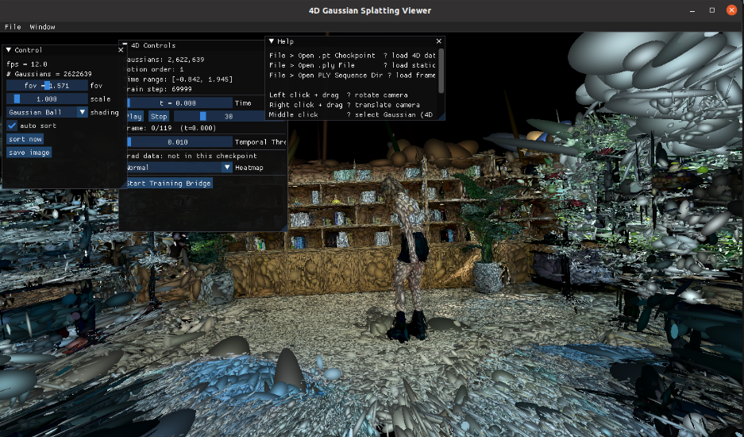

# 4D Gaussian Splatting Viewer (with 3D Static Support)



This is a lightweight and feature-rich Gaussian Splatting Viewer built with PyOpenGL and CUDARasterizer. Originally a simple 3D static viewer, it now includes full support for **4D Dynamic Gaussian Splatting**, enabling high-performance playback and analysis of temporal Gaussian data.

## 🚀 Key Features

### 4D Dynamic Support (New!)
- **Temporal Playback**: Real-time rendering of dynamic scenes from 4D motion checkpoints (`.pt`).
- **Motion Modeling**: Supports multi-order motion (velocity, acceleration, jerk, snap) with temporal opacity decay.
- **Interactive Inspection**: Ray-cast selection (Middle-Click) to inspect individual Gaussian attributes (position, velocity, duration, gradients, etc.).
- **Heatmap Visualization**: Dynamic color mapping for Velocity, Temporal Opacity, Duration, and Base Opacity.
- **Gradient Monitoring**: Toggle (Key `G`) to visualize accumulated training gradients as a heatmap.
- **PLY Sequence Loading**: Support for directories containing sequences of static `.ply` frames.
- **Training Bridge**: Real-time monitoring of training progress via socket communication.

### Standard Features
- **High-Performance Rendering**: Built-in PyOpenGL renderer with an optional official CUDA rasterizer backend.
- **Fast Sorting**: Accelerated sorting backend using `torch.argsort` or `cupy.argsort`.
- **Flexible Loading**: Compatible with official 3D GS `.ply` files and custom 4D `.pt` checkpoints.

## 📸 Visualizations

| Velocity Heatmap | Interactive Gaussian Inspection |
| :---: | :---: |
|  | *[Add Inspection Screenshot Here]* |

*(Note: Use `G` to toggle gradient heatmaps and the 4D Panel to switch between Velocity, Duration, and Opacity modes.)*

---

## 🛠️ Usage

### Installation
Install the core dependencies:
```bash
pip install -r requirements.txt
pip install torch  # Required for 4D (.pt) checkpoint loading
```

### Launching the Viewer
For the advanced **4D Viewer** (recommended):
```bash
python main_4d.py
```

For the original **3D Static Viewer**:
```bash
python main.py
```

### Loading Data
- **4D Checkpoints**: In the 4D viewer, go to `File > Open .pt Checkpoint` to load motion-enabled Gaussian data.
- **Static PLY**: Load official `.ply` files via `File > Open .ply File`.
- **Sequence**: Use `File > Open PLY Sequence Dir` to play back a folder of frame-by-frame `.ply` files.

## ⌨️ Shortcuts & Controls

| Action | Control |
| :--- | :--- |
| **Rotate Camera** | Left Click + Drag |
| **Translate Camera** | Right Click + Drag |
| **Roll Camera** | `Q` / `E` |
| **Zoom** | Scroll Wheel |
| **Pick Gaussian (4D)** | Middle Click |
| **Play/Pause 4D** | `Space` |
| **Toggle Gradient Heatmap** | `G` |

## 📦 Optional Dependencies

- **CUDA Backend**: Install [diff-gaussian-rasterization](https://github.com/graphdeco-inria/diff-gaussian-rasterization) and `pip install cuda-python`.
- **Accelerated Sorting**:
  - **PyTorch**: Install [PyTorch](https://pytorch.org/) for `torch` backend.
  - **CuPy**: `pip install cupy-cuda12x` (or relevant version) for `cupy` backend.

## 📝 Troubleshooting & Limitations

- **OpenGL Version**: Requires OpenGL >= 4.3 (does not support macOS due to SSBO dependency).
- **GPU Performance**: If you're experiencing slow rendering, ensure you are using a high-performance graphics card (check system settings).
- **Backend Sync**: Unofficial OpenGL results may slightly differ from the official CUDA version.

## 🗺️ Roadmap / TODO
- [ ] Add orthogonal projection
- [ ] Make the projection matrix fully compatible with official CUDA implementation
- [ ] Tighter billboard to reduce number of fragments
- [ ] Save/Load viewing parameters (camera poses)
- [ ] Support more 4D motion models

